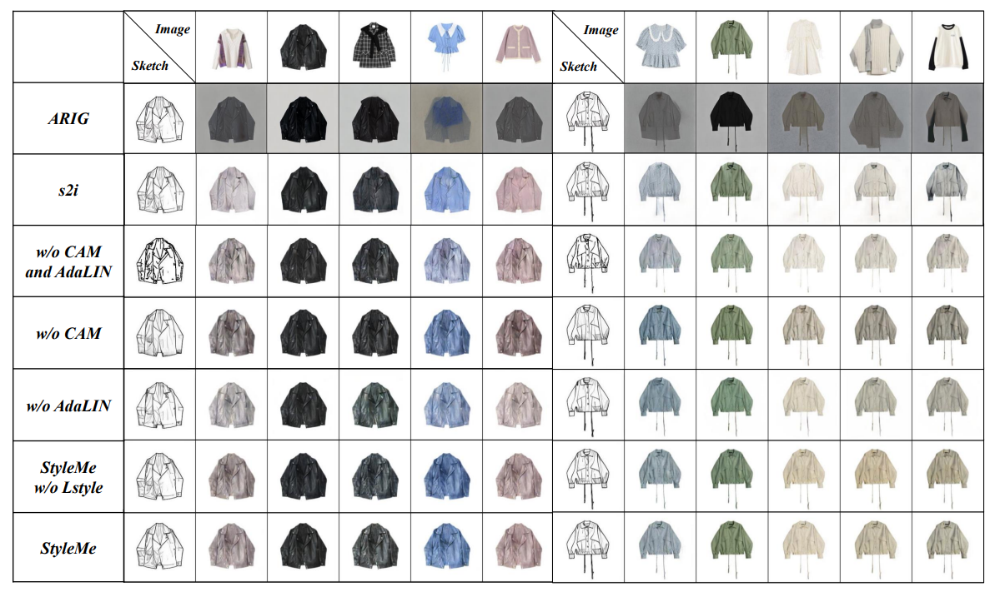

# StyleMe
Contain the following two parts：
- image to sketch model | [sketch_generation](https://github.com/ExponentiAI/StyleMe/tree/main/sketch_generation)
- sketch to image model | [style_transform](https://github.com/ExponentiAI/StyleMe/tree/main/styleme)

## Performance
Here is our model performance:

and the FID and LPIPS during training:

## Video
The video link：**[StyleMe Demonstration](https://user-images.githubusercontent.com/43172916/218964923-1f99907c-4841-4cca-a961-fc771f22834f.mp4)**

